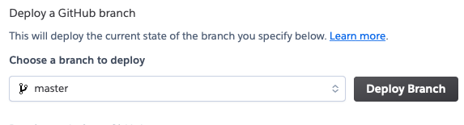
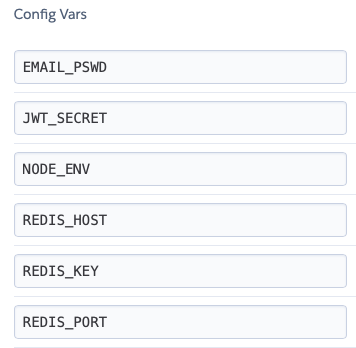

# Heroku

The Notes backend application runs on a Heroku Dyno.
 

### Deploying

Heroku has been configured to pull the Node.js code from the [wkande/notes](https://github.com/wkande/notes) repo to implement a manual deployment using the Heroku web console.

The [deploy.md](https://github.com/wkande/notes/blob/master/deploy.md) file contains a check-list of things to verify before deployment. 

  

### Configuration Vars

Several environment variables must be set for the Dyno to utilize on startup.

- EMAIL_PSWD:
The email password for the lelandcreek.com email server.

- JWT_SECRET:
The password to encrypt and decrypt the JWT tokens.

- NODE_ENV:
For Heroku set to **production**.

- REDIS_HOST:
The Redis Labs host address.

- REDIS_KEY:
The API key provided by Redis Labs for secure access.

- REDIS_PORT
The Redis Labs port for the host address.